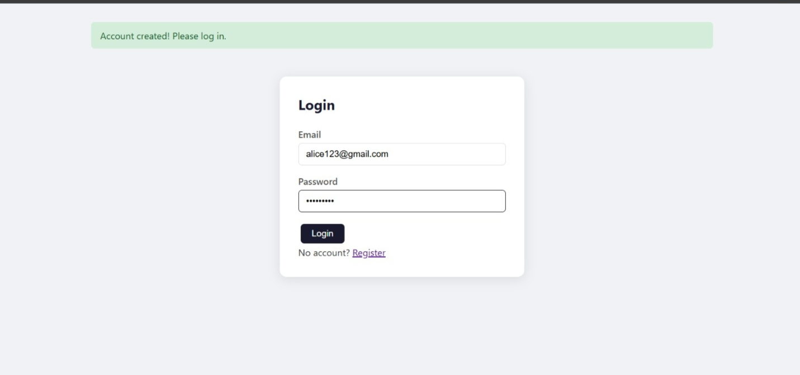
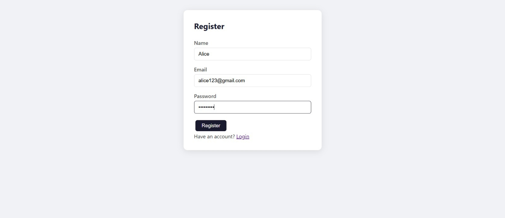
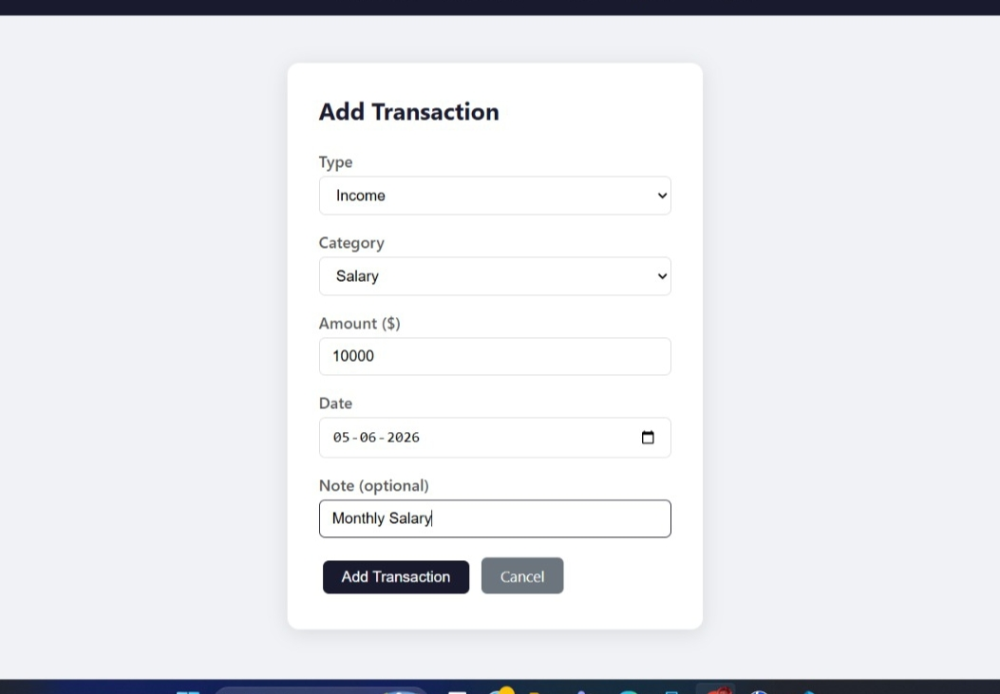
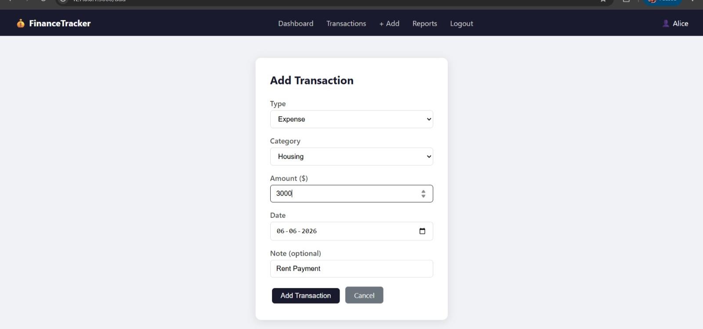
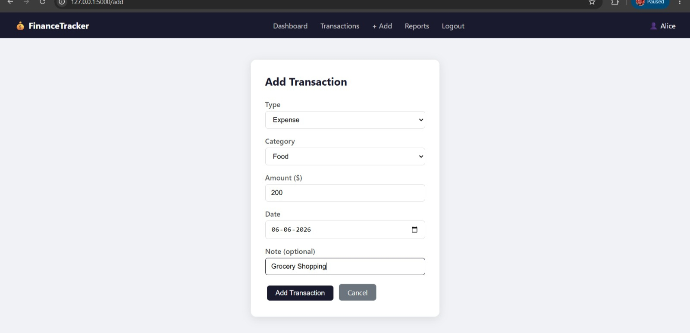
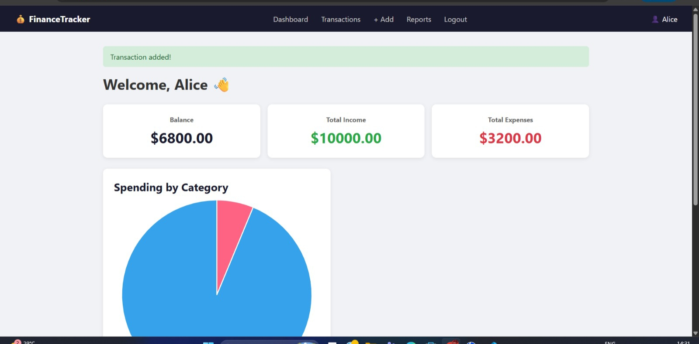
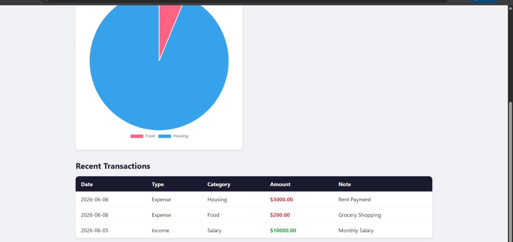
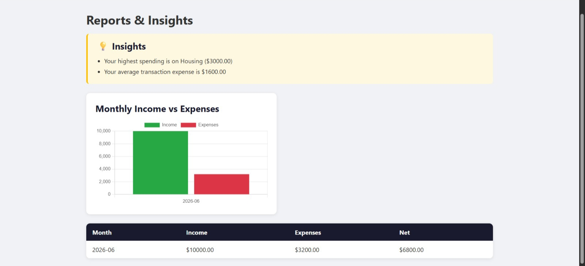

# 💰 Personal Finance Tracker

A full-stack web app built with Python Flask, Jinja2, SQLite, and Pandas.

## 🛠️ Tech Stack
- **Flask** — Web framework
- **Jinja2** — HTML templating
- **SQLite** — Database
- **Flask-Login** — Authentication
- **Flask-Bcrypt** — Password hashing
- **Pandas** — Data analysis
- **Chart.js** — Charts(via CDN)

## ✨ Features
- 🔐 User registration & login
- 💸 Add income & expense transactions
- 📊 Dashboard with pie chart
- 📈 Monthly reports & insights
- 🗑️ Delete transactions

## 📸 Screenshots

### Login





### Register





### Add Transaction - Income





### Add Transaction - Expense 1





### Add Transaction - Expense 2





### Dashboard - Chart 1





### Dashboard - Chart 2





### Reports





## 🚀 How to Run
```bash
pip install -r requirements.txt
python app.py